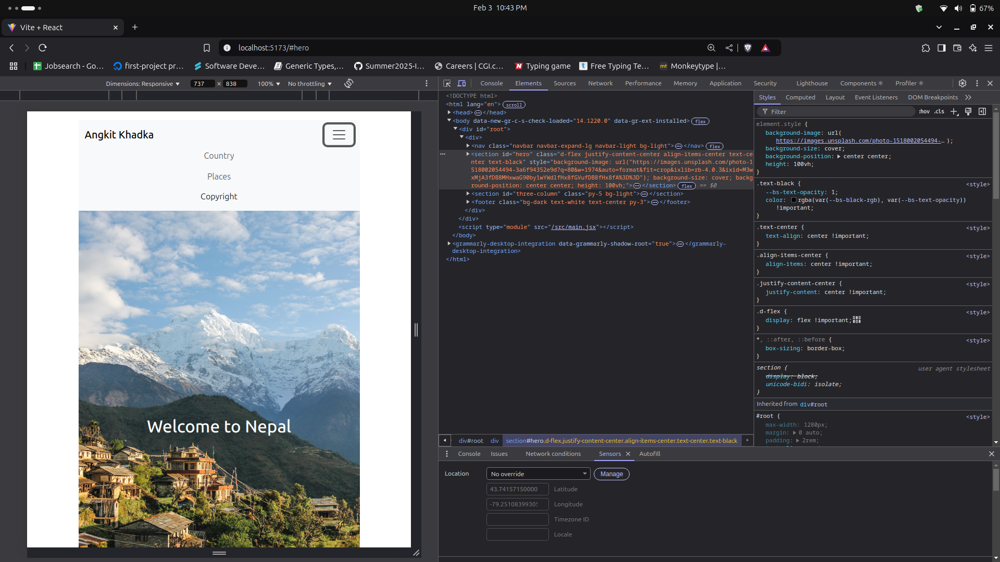
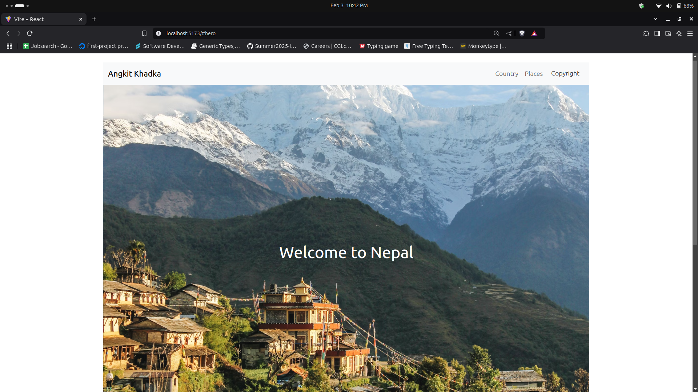

### Introduction

This project is a simple react application that introduces my country. This project is solely for my college assignment and demonstrates my ability to use bootstrap to make a responsive web design. The website is live [here](http://khadkaankit85.github.io/Advanced-Web-Development-at-Sault-College)

### Images

### Tech Stack

- react
- bootstrap
- html/css

### Project Structure

- **src/**: Contains the main source code.
  - **App.js**: The main component that renders the Navbar, Hero, and Body components.
  - **Navbar.js**: The navigation bar component.
  - **Hero.js**: The hero section component.
  - **Body.js**: The three-column layout component.
- **public/**: Contains static assets like images (if any) and the index.html file.
- **package.json**: Lists project dependencies and scripts.

### Acknowledgments

- Images sourced from Unsplash.
- Bootstrap for providing a robust and easy-to-use CSS framework.
