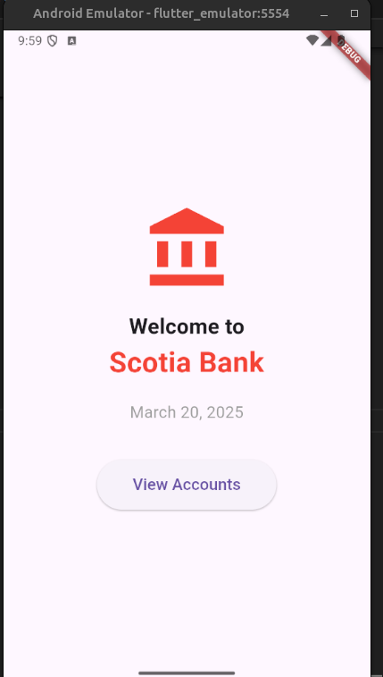
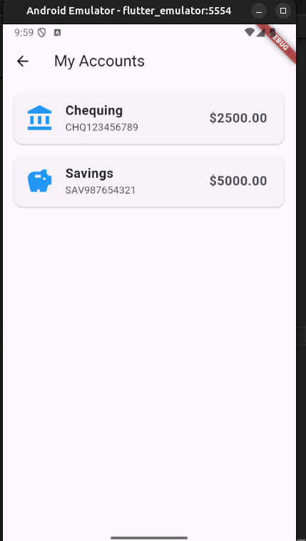
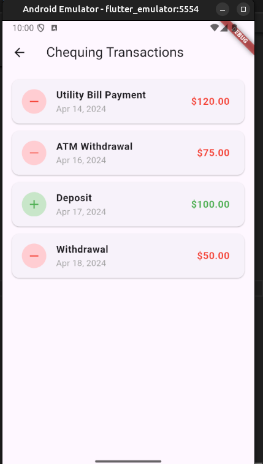

# Mobile Banking Application

A Flutter-based mobile banking application that provides a clean and intuitive interface for viewing account information and transaction history.

## How Does This Work?

This Flutter application has three main functionalities:

1. Welcome Screen: Displays a welcoming interface with the bank logo, current date, and a button to access account information.

2. Account Management: Loads and displays account information from a JSON file, showing different types of accounts (Chequing and Savings) with their respective balances.

3. Transaction History: Fetches transaction data from a JSON file and displays detailed transaction history for each account, including dates, descriptions, and amounts.

## Key Files

- `lib/main.dart`: The core file that sets up the application structure and navigation.
- `lib/screens/welcome_screen.dart`: Displays the welcome interface with bank logo and current date.
- `lib/screens/accounts_screen.dart`: Manages and displays the list of accounts.
- `lib/screens/transactions_screen.dart`: Shows detailed transaction history for selected accounts.
- `assets/accounts.json`: Contains account information (type, number, balance).
- `assets/transactions.json`: Stores transaction data for each account.
- `assets/images/`: Contains application images and icons.

## Navigation Flow

1. Welcome Screen → View Accounts
2. Accounts List → Transaction Details
3. Transaction Details → Back to Accounts List
4. Accounts List → Back to Welcome Screen

## Source & Modifications

- The application uses JSON files for data storage, making it easy to modify account and transaction information.
- The UI was designed using Flutter's Material Design components for a consistent and professional look.
- Transaction amounts are color-coded for better visual understanding.
- The app implements proper error handling and loading states for a smooth user experience.

## Why These Changes?

Made changes were targeted towards

- Building a professional banking interface
- Handling JSON data efficiently
- Implementing clean navigation patterns
- Creating responsive and user-friendly designs
- Managing state and data flow effectively

## Project Structure

- `lib/main.dart`: Main application entry point
- `lib/screens/`: Contains all the application screens
  - `welcome_screen.dart`: Welcome screen with bank logo
  - `accounts_screen.dart`: List of accounts
  - `transactions_screen.dart`: Transaction history
- `assets/`: Contains JSON data files
  - `accounts.json`: Account information
  - `transactions.json`: Transaction history

## Navigation Flow

1. Welcome Screen → View Accounts
2. Accounts List → Transaction Details
3. Transaction Details → Back to Accounts List
4. Accounts List → Back to Welcome Screen

## UIs

