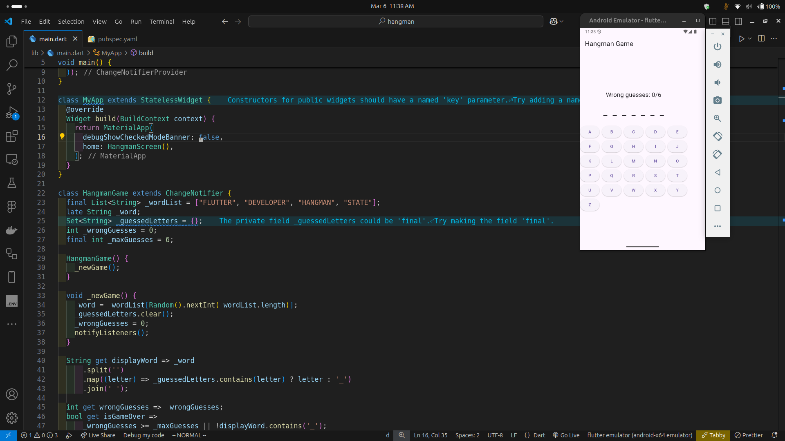

### Hangman

Hangman game

### How Does This Work?

This Flutter application has two main functionalities:

Student Marks Management: Uses an SQLite database to store and manage student names and their respective marks.

Pokémon TCG Card Viewer: Fetches Pokémon Trading Card Game data from the Pokémon TCG API and displays the cards in a ListView. Clicking on a card enlarges the image.

### Key Files

- `main.dart`: The core file that includes both features—managing student marks and displaying Pokémon cards.
- `pubspec.yaml`: Lists dependencies like http for API requests and sqflite for database management.
- `images/home.gif`: A preview of how the homepage looks.

### Source & Modifications

- The Pokémon TCG API is used to fetch card images and details.
- The UI was designed using Flutter's built-in ListView, TextField, Button, and AlertDialog widgets.

### Why These Changes?

- I made these changes to make flutter ui and add persistence to the app.

### Homepage

