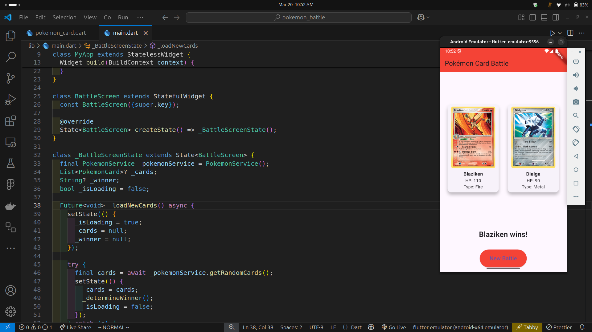

# Pokémon Card Battle Game

A Flutter application that creates an exciting Pokémon card battle experience using the Pokémon Trading Card Game (TCG) API.

## How Does This Work?

This Flutter application has the following features:

1. **Random Card Selection**: Fetches two random Pokémon cards from the Pokémon TCG API
2. **Card Display**: Shows the selected cards with their images and HP values
3. **Battle System**: Compares the HP of both cards and declares a winner
4. **Replay Functionality**: Includes a button to start a new battle with different random cards

## Key Files

- `lib/main.dart`: The main application file containing the UI and battle logic
- `pubspec.yaml`: Project configuration and dependencies
- `lib/services/pokemon_service.dart`: Handles API calls to the Pokémon TCG API
- `lib/models/pokemon_card.dart`: Data model for Pokémon cards

## Features

- Real-time card fetching from the Pokémon TCG API
- Visual display of card images and stats
- HP-based battle system
- One-click battle reset functionality
- Modern and responsive UI design

## Dependencies

- `http`: For making API requests to the Pokémon TCG API
- `flutter`: For the UI components
- `provider`: For state management

## API Reference

This project uses the [Pokémon TCG API](https://pokemontcg.io/) to fetch card data. The API provides access to a comprehensive database of Pokémon Trading Card Game cards.

## Home

